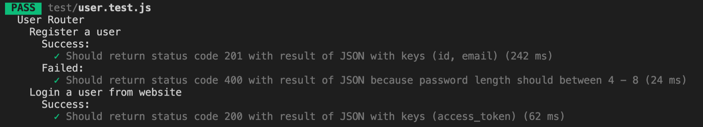

1. install --save-dev jest
2. buat folder test dan simpan file dengan nama_file.test.js
3. penulisan meliputi
```
  describe('User Router', function() {
    describe('Register a User', function() {
      describe('Success:', function() {
        test('Should return status cod 201 with result of JSON with keys(id, email), function(done) {
          done();
        });
      });
    });
  });
```
panggil done ketika proses selesai, dan apabila di function test terjadi proses async dan diberikan parameter done. describe akan membuat tab baru, test akan membuat centang dan tulisan abu-abu lihat di gambar berikut.


4. ubah file package.json script test menjadi "NODE_ENV=test jest --runInBand --detectOpenHandles --verbose" sesuai kan dengan komputer kalian masing-masing
5. buat description dan test sesuai yang ingin di test baca dokumentasi disini:

https://jestjs.io/docs/en/expect

6. buat kodingan kalian jalan, dimulai dari
7. install sequelize pg bcryptjs express jsonwebtoken, dev = dotenv
8. untuk menjalankan config create bisa gunakan db:create --env test, dan untuk migrate db:migrate --env test
9. pastikkan dotenv kalian tepat
10. setelah sesuai dengan test kalian, silahkan refactor kemudian lanjut membuat pengembangan testing kalian selanjutnya dan di kode setelahnya hingga beres seperti ini



11. pastikkan setiap kali kalian running kosongkan database kalian menggunakan queryInterface.bulkDelete. dokumentasi global bisa dibaca disini:

https://jestjs.io/docs/en/api

12. apabila kalian ada routing yang menggunakan dependencies yang membutuhkan limitasi quota atau waktu seperti googleSignIn dan nodemailer kalian dapat memanfaatkan stud untuk mocking hasil kembalian dari dependencies tersebut. cara mudah menggunakan metode stud dari sinon (devDependencies). silahkan baca di ./test/user.test.js line 3-5, 70-73 untuk lebih jelas cara penggunaannya.

13. sudah ditambahkan hint di ./test/product.test.js apabila kalian ingin mengenerate fake data untuk testing